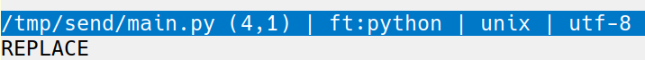

# replace

In (neo)vim, when you press R and switch to **replace mode**,
you get a visual feedback in the info bar.

I missed it in micro, I never knew if I was in replace mode or not. With this plugin, micro behaves like (neo)vim.

In micro, this mode can be activated / deactivated with the Insert key. Of course, when you deactivate replace mode,
the text "REPLACE" disappears.

## Usage

Add this line to your `bindings.json`:

    "Insert": "lua:replace.Replace,ToggleOverwriteMode",
